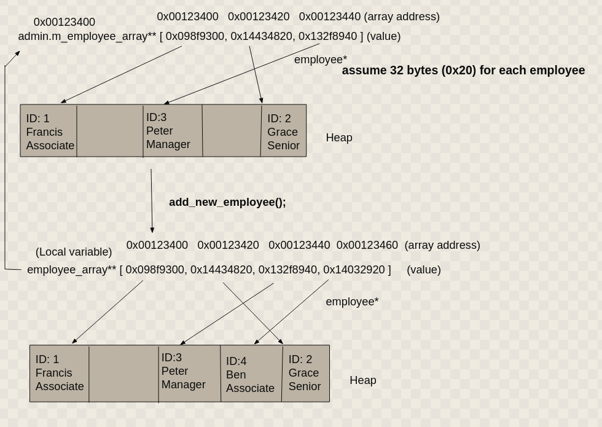
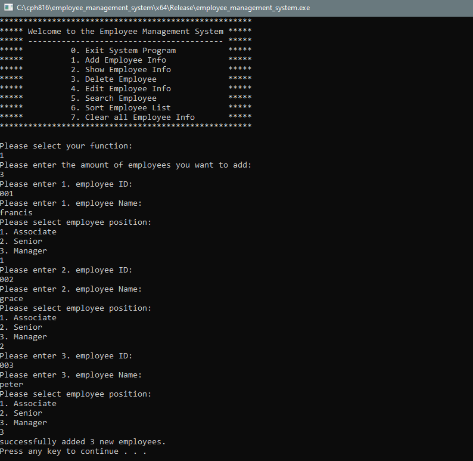
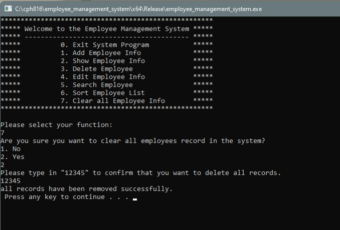
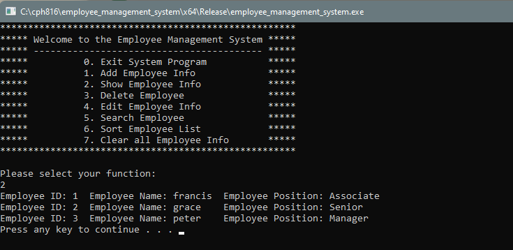

# employee_management_app
- A employee management app that runs on the terminal
- implemented with inheritance and polymorphism
- file I/O acts as a permanent save
- heap memory allocation

How a new employee is added via heap allocation

